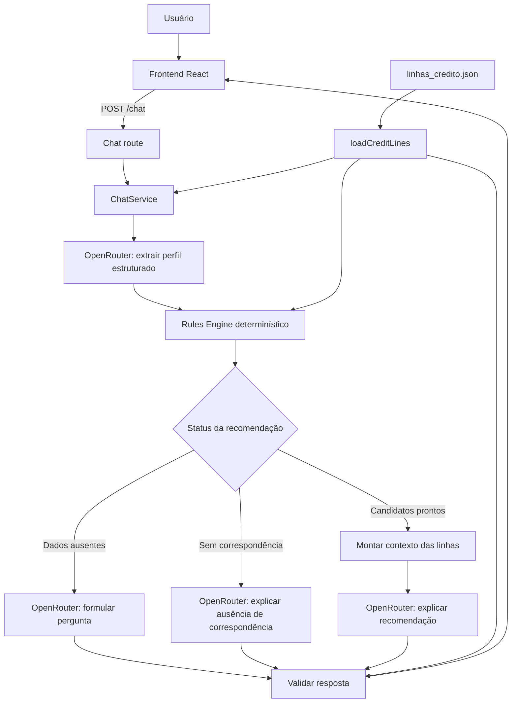

# Como a Aplicação Funciona

Este documento descreve o funcionamento atual do assistente de linhas de crédito do BNDES. O sistema orienta empresas com base em fontes oficiais, mas não aprova crédito, não define taxas e não garante condições.

## Visão geral

O usuário envia uma mensagem pelo frontend. O backend interpreta a necessidade, transforma a mensagem em dados estruturados, aplica regras determinísticas para identificar linhas potencialmente relevantes e usa uma LLM apenas para explicar o resultado em linguagem natural.



## Inicialização do backend

O ponto de entrada é [backend/src/server.ts](backend/src/server.ts). Ele carrega as variáveis de ambiente com `dotenv`, chama `loadConfig()` e inicia o Express na porta definida por `PORT`, ou na porta `3000` quando essa variável não existe.

[backend/src/core/config.ts](backend/src/core/config.ts) valida as configurações necessárias para o OpenRouter:

- `OPENROUTER_API_KEY`: chave usada somente pelo backend.
- `OPENROUTER_MODEL_PRIMARY`: modelo que será usado primeiro.
- `OPENROUTER_MODEL_FALLBACK`: modelo opcional usado quando o principal falhar.
- `OPENROUTER_TIMEOUT_MS`: tempo máximo de cada tentativa de chamada ao modelo.
- `OPENROUTER_BASE_URL`: URL-base da API do OpenRouter.

Em seguida, [backend/src/app.ts](backend/src/app.ts) cria a aplicação Express e registra:

- Parser de JSON, com limite de corpo de `1mb`.
- Middleware de CORS.
- Logs de início e término de cada requisição HTTP.
- Rota de conversa em `/chat`.
- Rota de saúde em `/health`.
- Middleware de erro que devolve `503` quando todos os modelos OpenRouter estiverem indisponíveis e `500` para outros erros internos.

## Entrada HTTP e conversa

[backend/src/api/routes/chat.routes.ts](backend/src/api/routes/chat.routes.ts) atende `POST /chat`. Ela recebe:

```json
{
  "message": "Quero comprar uma máquina para minha empresa.",
  "conversationId": "opcional",
  "conversationHistory": [
    { "role": "user", "content": "Mensagem anterior" },
    { "role": "assistant", "content": "Resposta anterior" }
  ]
}
```

A rota exige uma `message` não vazia. `conversationId` é opcional e deve ser texto. O histórico é opcional, aceita somente os papéis `user` e `assistant` e possui no máximo dez turnos.

Depois dessa validação, a rota chama `ChatService.chat()`, em [backend/src/services/ChatService.ts](backend/src/services/ChatService.ts). O serviço gera um `conversationId` quando ele não foi informado e orquestra todo o pipeline de conversa.

## Knowledge base

A fonte de dados é [backend/data/linhas_credito.json](backend/data/linhas_credito.json). Ela contém as linhas de crédito conhecidas, incluindo público, finalidade, condições, forma de solicitação, URL oficial e data de consulta.

A parte responsável por consolidar esses dados é [backend/src/knowledgeBase/loadCreditLines.ts](backend/src/knowledgeBase/loadCreditLines.ts), por meio da função `loadCreditLines()`.

O carregador executa quatro tarefas:

1. Lê o arquivo JSON do disco.
2. Confirma que existe o array `linhas`.
3. Valida os campos obrigatórios de cada linha e exige fonte do publicador `BNDES` em `https://www.bndes.gov.br/`.
4. Normaliza os nomes de campos do JSON, de `snake_case`, para o tipo interno `CreditLine`, em `camelCase`.

O `ChatService` chama `loadCreditLines()` em seu construtor e mantém o resultado em `creditLines`. Essa lista tipada é reutilizada ao decidir recomendações, montar o contexto confiável enviado à LLM e validar links retornados na resposta.

Com as quatro linhas atuais, essa abordagem funciona como retrieval determinístico por metadados e regras. Não há busca vetorial: as informações são selecionadas pelo motor de regras e fornecidas diretamente ao modelo apenas quando forem relevantes.

## Extração de dados com OpenRouter

[backend/src/modelGateway/openRouterClient.ts](backend/src/modelGateway/openRouterClient.ts) é o único módulo que se conecta ao OpenRouter. Ele encapsula a chamada HTTP para `POST /chat/completions`, usando `fetch` nativo do Node.js.

O cliente recebe `AppConfig` e possui um transporte injetável, `OpenRouterTransport`. Essa injeção permite testar o gateway com respostas simuladas, sem chave real e sem chamadas externas.

O fluxo começa com `extractProfile()`. Esse método recebe a mensagem atual, já combinada com até dez turnos do histórico quando ele existe. Ele envia ao OpenRouter um prompt que pede somente JSON, com os campos abaixo:

- `financingPurpose`: finalidade, como equipamento, capital de giro ou serviços tecnológicos.
- `financingPurposePriority`: prioridade quando há mais de uma finalidade.
- `companySize`: porte da empresa.
- `equipmentOrigin`: origem do equipamento.
- `equipmentBndesApproved`: indicação de credenciamento do equipamento.
- `serviceProviderBndesApproved`: indicação de credenciamento do prestador de serviços.
- `asksGuaranteeOrRate`: sinalizador para pedidos de aprovação garantida ou menor taxa.

A chamada usa `response_format: { type: "json_object" }` e temperatura `0`. Ao receber a resposta, `parseExtraction()` confere se o conteúdo é JSON e filtra os valores para os tipos permitidos. Informações ausentes ou inválidas são normalizadas para `unknown`, `undefined` ou lista vazia. Assim, o restante da aplicação não depende de texto livre gerado pelo modelo.

## Decisão determinística

[backend/src/recommendationEngine/rulesEngine.ts](backend/src/recommendationEngine/rulesEngine.ts) recebe o perfil estruturado e a lista de `CreditLine`. A função `recommend()` não chama LLM e não lê a mensagem original do usuário.

Cada identificador de linha possui uma função em `MATCHERS` que define se ela pode ser considerada e quais confirmações ainda faltam. Por exemplo:

- `finame` exige finalidade de equipamento e exclui equipamento usado ou importado; também pode pedir origem e credenciamento.
- `credito-pme` entra quando a finalidade é capital de giro.
- `credito-servicos-4-0` entra para serviços tecnológicos e pode pedir o credenciamento do fornecedor.
- `credito-digital` é uma possibilidade adicional para MEI, micro, pequenas e médias empresas que já tenham informado uma finalidade.

O motor devolve um `RecommendationResult` com candidatos, campos ausentes e um status:

- `refused_premise`: o pedido contém uma premissa inadequada, como aprovação garantida ou menor taxa.
- `needs_more_info`: ainda faltam dados para orientar com segurança.
- `ready`: há candidatos sem pendências.
- `no_match`: nenhuma linha se relaciona de forma segura ao pedido atual.

Portanto, a aplicação não delega a elegibilidade ao modelo. O modelo só ajuda a transformar linguagem natural em um perfil controlado e a explicar o resultado decidido pelo código.

## Geração da resposta

Depois de receber o resultado das regras, `ChatService.chat()` segue um dos caminhos abaixo:

1. Para `asksGuaranteeOrRate`, pede ao OpenRouter uma resposta curta que recuse a premissa e redirecione a conversa para a finalidade do crédito.
2. Para `needs_more_info`, monta uma pergunta objetiva a partir dos campos faltantes, como origem do equipamento ou credenciamento BNDES, e pede ao OpenRouter que a redija sem listar linhas.
3. Para `no_match`, pede uma explicação curta e uma pergunta que ajude a descobrir a finalidade.
4. Para `ready`, seleciona as linhas candidatas, monta um contexto com nome, finalidade financiada, condições, URL oficial e data de consulta, e pede ao OpenRouter que explique por que elas podem ser relevantes.

Essa segunda operação do gateway é `explainRecommendation()`. O prompt de sistema exige uma resposta curta, em português, baseada somente no contexto confiável, sem inventar taxas, prazos, garantias ou critérios. Quando uma linha é apresentada, também solicita o disclaimer sobre a análise do agente financeiro.

O método interno `complete()` executa todas as chamadas ao OpenRouter. Ele tenta primeiro o modelo principal e depois o fallback, caso este esteja configurado. Cada tentativa possui timeout com `AbortController`; erros HTTP, rede, conteúdo vazio ou timeout fazem o cliente tentar o próximo modelo.

## Validação e resposta final

Antes de enviar a mensagem ao frontend, `ChatService` chama `validateOutput()` de [backend/src/validators/outputValidator.ts](backend/src/validators/outputValidator.ts).

O validador verifica se a resposta contém frases proibidas, como `aprovação garantida`, `menor taxa` ou `será aprovado`. Ele também extrai URLs e aceita somente aquelas presentes nas fontes carregadas da knowledge base.

Quando a validação falha, o serviço devolve uma mensagem segura e genérica, preservando as citações determinísticas associadas aos candidatos. Quando ela passa, a resposta retornada por `POST /chat` possui este formato:

```json
{
  "conversationId": "abc123",
  "message": "Explicação em linguagem natural.",
  "citations": [
    {
      "url": "https://www.bndes.gov.br/...",
      "date": "2026-08-18"
    }
  ]
}
```

As citações não dependem de o modelo escolher links. Elas são formadas a partir das linhas selecionadas pelo `rulesEngine` e dos dados validados da knowledge base.

## Health check e logs

[backend/src/api/routes/health.routes.ts](backend/src/api/routes/health.routes.ts) atende `GET /health`. Ela indica se a configuração contém uma chave do OpenRouter e inclui o tempo de atividade do processo.

[backend/src/core/logger.ts](backend/src/core/logger.ts) centraliza os logs. As camadas usam domínios como `http`, `chat`, `openrouter`, `recommendation`, `validation` e `knowledge_base`, registrando eventos como carregamento das linhas, extração do perfil, decisão das regras, uso de modelo, falhas de validação e duração das requisições.

## Testes

Os testes do backend usam transportes mockados para que `npm test` não dependa do OpenRouter real. Eles cobrem:

- Regras de recomendação e casos adicionais em `rulesEngine.test.ts` e `rulesEngine.additional.test.ts`.
- Casos de avaliação em `evaluation.test.ts`.
- Gateway OpenRouter, JSON estruturado e fallback em `openRouterClient.test.ts`.
- Guardrails de saída em `outputValidator.test.ts`.
- Pipeline do `ChatService` em `chatService.e2e.test.ts`.
- Contratos HTTP em `app.http.test.ts`.
