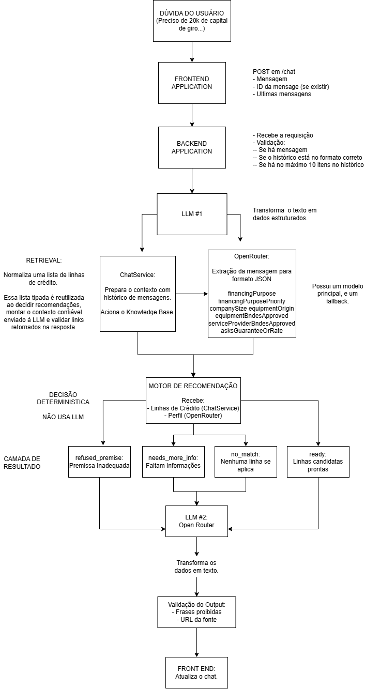

# Diagramas de Arquitetura

## Representação Visual

<a href="VisualDiagram.png"></a>

## 1. Fluxo de IA: da mensagem do usuario ate a resposta

Apresenta o pipeline completo de Engenharia de IA:

```text
+--------------------+       +--------------------------+       +--------------------------+
| Usuario            |       | Frontend React           |       | Backend Node + Express   |
| Digita uma duvida  |       | App / ChatWindow         |       | POST /chat               |
+---------+----------+       +------------+-------------+       +------------+-------------+
          |                               |                                  |
          | envia mensagem                 | POST /chat                       |
          +------------------------------>+ { message, conversationId?,       |
                                          |   conversationHistory? }          |
                                          +----------------------------------->+
                                                                             |
                                                                             v
                                                              +------------------------------+
                                                              | Validacao da rota            |
                                                              | - mensagem obrigatoria        |
                                                              | - historico valido, max. 10  |
                                                              +--------------+---------------+
                                                                             |
                                                                             v
                                                              +------------------------------+
                                                              | ChatService.chat()           |
                                                              | Gera conversationId quando   |
                                                              | necessario e orquestra fluxo |
                                                              +---+----------------------+---+
                                                                  |                      |
                         +----------------------------------------+                      +----------------------+
                         |                                                                                     |
                         v                                                                                     v
       +-----------------------------------+                                         +----------------------------------+
       | Knowledge Base                    |                                         | Preparar entrada de extracao     |
       | linhas_credito.json               |                                         | mensagem atual + historico       |
       +----------------+------------------+                                         +----------------+-----------------+
                        |                                                                             |
                        v                                                                             v
       +-----------------------------------+                                         +----------------------------------+
       | loadCreditLines()                 |                                         | OpenRouter.extractProfile()      |
       | - le JSON                         |                                         | LLM #1: texto -> JSON            |
       | - valida fontes BNDES             |                                         | temperatura 0                    |
       | - normaliza para CreditLine       |                                         | response_format: json_object     |
       +----------------+------------------+                                         +----------------+-----------------+
                        |                                                                             |
                        |                                                                             +------------------+
                        |                                                                                                |
                        |                                                                     falha/timeout/JSON vazio
                        |                                                                                                v
                        |                                                            +----------------------------------+
                        |                                                            | Tenta modelo fallback             |
                        |                                                            | Se todos falharem: erro HTTP 503  |
                        |                                                            +----------------------------------+
                        |                                                                             |
                        +---------------------------------------------+-------------------------------+
                                                              |
                                                              v
                                             +------------------------------------+
                                             | parseExtraction()                  |
                                             | Valida e normaliza o perfil JSON   |
                                             | Campos ausentes -> unknown / []    |
                                             +----------------+-------------------+
                                                              |
                                                              v
                                             +------------------------------------+
                                             | rulesEngine.recommend()            |
                                             | DECISAO DETERMINISTICA, SEM LLM    |
                                             | Perfil JSON + CreditLine[]         |
                                             +----------------+-------------------+
                                                              |
                                                              v
                                             +------------------------------------+
                                             | RecommendationResult               |
                                             | status + candidatos + pendencias   |
                                             +----------------+-------------------+
                                                              |
      +---------------------------+---------------------------+---------------------------+---------------------------+
      |                           |                           |                           |                           |
      v                           v                           v                           v                           v
+------------------+    +--------------------+    +--------------------+    +----------------------------+
| refused_premise  |    | needs_more_info    |    | no_match           |    | ready                      |
| Recusar promessa |    | Perguntar campos   |    | Explicar ausencia  |    | Selecionar dados somente   |
| de taxa/aprovacao|    | obrigatorios       |    | de correspondencia |    | dos candidatos da KB       |
+---------+--------+    +---------+----------+    +---------+----------+    +-------------+--------------+
          |                       |                         |                            |
          +-----------------------+-------------------------+----------------------------+
                                                              |
                                                              v
                                             +------------------------------------+
                                             | OpenRouter.explainRecommendation() |
                                             | LLM #2: redige texto em portugues  |
                                             | Usa apenas instrucao e contexto    |
                                             | confiavel fornecidos pelo backend   |
                                             +----------------+-------------------+
                                                              |
                                                              v
                                             +------------------------------------+
                                             | validateOutput()                   |
                                             | - frases proibidas                 |
                                             | - URLs na allow-list da KB         |
                                             +----------------+-------------------+
                                                              |
                                      +-----------------------+-----------------------+
                                      |                                               |
                                      v                                               v
                    +--------------------------------+             +------------------------------------+
                    | Resposta valida                |             | Resposta invalida                  |
                    | ChatResponse:                  |             | Mensagem segura de fallback        |
                    | conversationId, message,       |             | Citacoes deterministicas           |
                    | citations                      |             +----------------+-------------------+
                    +----------------+---------------+                              |
                                     |                                              |
                                     +----------------------+-----------------------+
                                                            |
                                                            v
                                             +------------------------------------+
                                             | Frontend atualiza o chat           |
                                             | Exibe mensagem e citacoes oficiais |
                                             +------------------------------------+
```

- A knowledge base e local, versionada e composta por fontes oficiais do BNDES; nao ha banco vetorial nem embeddings.
- O modelo nao escolhe a linha de credito. Ele extrai dados do texto e redige uma explicacao baseada no resultado decidido pelo codigo.
- O modelo principal possui timeout e pode usar um modelo fallback.
- Links e alegacoes sensiveis sao validados antes de chegar ao usuario.

### Versao alternativa do diagrama 1: leitura guiada

Esta e uma segunda representacao do mesmo fluxo. Ela foi organizada como uma historia em sete passos, para ser uma versão facilitada.

```text
    1. USUARIO EXPLICA A NECESSIDADE
    +--------------------------------------------+
    | "Quero comprar uma maquina para a empresa"|
    +----------------------+---------------------+
                                                 |
                                                 v
    2. FRONTEND ENVIA A MENSAGEM
    +--------------------------------------------+
    | React envia POST /chat                      |
    | - mensagem                                  |
    | - ID da conversa, se ja existir             |
    | - ultimas mensagens da conversa             |
    +----------------------+---------------------+
                                                 |
                                                 v
    3. BACKEND CONFERE O PEDIDO
    +--------------------------------------------+
    | A rota valida:                              |
    | - existe uma mensagem?                      |
    | - o historico tem formato valido?           |
    | - ha no maximo 10 itens no historico?       |
    +----------------------+---------------------+
                                                 |
                                                 v
    4. LLM TRANSFORMA TEXTO EM DADOS ESTRUTURADOS
    +--------------------------------------------+        +-----------------------------------+
    | ChatService prepara o contexto             |------->| OpenRouter - LLM de extracao      |
    | com a mensagem e o historico               |        | Pede somente um objeto JSON        |
    +--------------------------------------------+        +-----------------+-----------------+
                                                                                                                                             |
                                                                                                                                             v
                                                                                                        +-----------------------------------+
                                                                                                        | Perfil estruturado                |
                                                                                                        | - finalidade do credito           |
                                                                                                        | - porte da empresa                |
                                                                                                        | - origem/credenciamento do bem    |
                                                                                                        | - pedido de taxa ou aprovacao?    |
                                                                                                        +-----------------+-----------------+
                                                                                                                                            |
                                        Se a LLM falhar, exceder o timeout ou nao devolver JSON
                                                                                                                                            |
                                                                                                                                            v
                                                                                                        +-----------------------------------+
                                                                                                        | Tentar modelo fallback            |
                                                                                                        | Se tambem falhar: devolver 503    |
                                                                                                        +-----------------------------------+
                                                                                                                                            |
                                                                                                                                            v
    5. CODIGO DECIDE; A LLM NAO DECIDE ELEGIBILIDADE
    +--------------------------------------------+        +-----------------------------------+
    | Knowledge base                              |------->| Motor de regras                    |
    | linhas_credito.json                         |        | Usa perfil JSON + fatos BNDES      |
    | Dados e fontes oficiais                     |        | Decide candidatos e pendencias      |
    +--------------------------------------------+        +-----------------+-----------------+
                                                                                                                                            |
                                                                                                                                            v
                                                                                                        +-----------------------------------+
                                                                                                        | Resultado da decisao              |
                                                                                                        |                                  |
                                                                                                        | [A] Premissa inadequada           |
                                                                                                        | [B] Faltam informacoes            |
                                                                                                        | [C] Nenhuma linha se aplica       |
                                                                                                        | [D] Linhas candidatas prontas    |
                                                                                                        +-----------------+-----------------+
                                                                                                                                            |
                                +---------------------+-----------------------------+------------------------------+
                                |                     |                             |                              |
                                v                     v                             v                              v
            +-------------------+ +---------------------+     +---------------------+      +------------------------+
            | [A] Recusar       | | [B] Perguntar       |     | [C] Explicar que    |      | [D] Montar contexto     |
            | garantia/taxa e   | | somente o que falta |     | nao ha correspond.  |      | apenas das linhas        |
            | redirecionar      | | para orientar       |     | e pedir finalidade  |      | candidatas da KB         |
            +---------+---------+ +----------+----------+     +----------+----------+      +-----------+------------+
                                |                      |                           |                           |
                                +----------------------+---------------------------+---------------------------+
                                                                                                                                            |
                                                                                                                                            v
    6. LLM REDIGE A RESPOSTA, COM LIMITES CLAROS
    +-----------------------------------------------------------------------------------------------+
    | OpenRouter - LLM de resposta                                                                  |
    | - recebe a instrucao definida pelo resultado das regras                                       |
    | - em recomendacoes, recebe somente fatos e fontes das linhas candidatas                      |
    | - nao pode inventar taxas, prazos, garantias ou criterios                                    |
    +-----------------------------------------------+-----------------------------------------------+
                                                                                                    |
                                                                                                    v
    7. BACKEND PROTEGE A RESPOSTA ANTES DE EXIBIR
    +-----------------------------------------------+       +-----------------------------------------+
    | validateOutput()                              |------>| Resposta ao frontend                    |
    | - bloqueia promessas de aprovacao/taxa        |       | - mensagem em linguagem natural         |
    | - aceita apenas URLs oficiais da knowledge base|       | - citacoes de fontes oficiais            |
    | - usa texto seguro se a validacao falhar      |       | - conversationId                         |
    +-----------------------------------------------+       +-----------------------------------------+
```

1. A pessoa descreve o que precisa em linguagem natural.
2. A primeira chamada de LLM so organiza essa mensagem em campos controlados.
3. O motor de regras, usando a base oficial do BNDES, toma a decisao sem delegar elegibilidade ao modelo.
4. A segunda chamada de LLM apenas transforma a decisao em uma resposta clara para a pessoa.
5. Antes de responder, o backend verifica promessas indevidas e links que nao fazem parte das fontes oficiais.

### Versão de fluxo vertical

Esta terceira leitura do diagrama 1 preserva o mesmo funcionamento, mas reduz a quantidade de setas paralelas.

```text
    +------------------------------------------------------------+
    | 1. USUARIO                                                 |
    | Descreve a necessidade em linguagem natural.               |
    | Ex.: "Quero comprar uma maquina para a minha empresa."    |
    +-----------------------------+------------------------------+
                                                                |
                                                                v
    +------------------------------------------------------------+
    | 2. FRONTEND (React)                                        |
    | Envia POST /chat com a mensagem, o ID da conversa e        |
    | as ultimas mensagens do historico.                         |
    +-----------------------------+------------------------------+
                                                                |
                                                                v
    +------------------------------------------------------------+
    | 3. API E ORQUESTRACAO (Express + ChatService)              |
    | Valida a requisicao e prepara a mensagem para processamento.|
    +-----------------------------+------------------------------+
                                                                |
                                                                v
    +------------------------------------------------------------+
    | 4. LLM #1: EXTRACAO                                         |
    | OpenRouter transforma texto em um perfil JSON controlado:  |
    | finalidade, porte, origem/credenciamento e sinais de risco.|
    |                                                            |
    | Falhou, demorou demais ou nao devolveu JSON?                |
    | -> tenta o modelo fallback; se falhar, responde HTTP 503.  |
    +-----------------------------+------------------------------+
                                                                |
                                                                v
    +------------------------------------------------------------+
    | 5. DECISAO EM CODIGO (sem LLM)                             |
    | rulesEngine combina o perfil JSON com a knowledge base     |
    | oficial do BNDES e decide candidatos ou pendencias.        |
    +-----------------------------+------------------------------+
                                                                |
                                                                v
    +------------------------------------------------------------+
    | 6. QUAL E O PROXIMO PASSO?                                 |
    +------------------------------------------------------------+
             |                     |                    |              |
             v                     v                    v              v
    +-----------+        +-----------+       +-----------+   +----------------+
    | Premissa  |        | Faltam    |       | Sem linha |   | Candidatos     |
    | inadequada|        | dados     |       | compativel|   | prontos        |
    +-----+-----+        +-----+-----+       +-----+-----+   +--------+-------+
                |                    |                   |                  |
                +--------------------+-------------------+------------------+
                                                                |
                                                                v
    +------------------------------------------------------------+
    | 7. LLM #2: RESPOSTA EM LINGUAGEM NATURAL                   |
    | Redige, conforme a decisao:                                |
    | - recusa uma promessa de taxa/aprovacao;                   |
    | - pergunta somente o dado que falta;                       |
    | - explica que nao encontrou correspondencia; ou            |
    | - explica candidatos usando apenas fatos da knowledge base.|
    +-----------------------------+------------------------------+
                                                                |
                                                                v
    +------------------------------------------------------------+
    | 8. VALIDACAO E ENTREGA                                      |
    | validateOutput() bloqueia promessas indevidas e URLs fora  |
    | das fontes oficiais. O frontend recebe mensagem, citacoes  |
    | e conversationId para exibir no chat.                      |
    +------------------------------------------------------------+
```

## 2. Conversao: texto do usuario para JSON e JSON para resposta

Detalha a parte mais ligada a LLM. Ele separa claramente o JSON que a LLM produz do JSON HTTP que a aplicacao devolve ao frontend.

```text
+----------------------------------------------------------------------------------+
| ENTRADA EM LINGUAGEM NATURAL                                                     |
| "Tenho uma pequena industria e quero comprar uma maquina nova para produzir."   |
+----------------------------------+-----------------------------------------------+
                                   |
                                   | mensagem atual + ate 10 itens de historico
                                   v
+----------------------------------------------------------------------------------+
| ChatService.buildExtractionInput()                                                |
| Consolida o contexto conversacional para entender referencias da conversa.       |
+----------------------------------+-----------------------------------------------+
                                   |
                                   v
+----------------------------------------------------------------------------------+
| PROMPT DE EXTRACAO - OpenRouter.extractProfile()                                 |
| LLM #1                                                                            |
| - instrucao: responder somente JSON                                               |
| - response_format: { type: "json_object" }                                      |
| - temperatura: 0                                                                 |
+----------------------------------+-----------------------------------------------+
                                   |
                                   v
+----------------------------------------------------------------------------------+
| JSON BRUTO DA LLM                                                                |
| {                                                                                |
|   "financingPurpose": ["equipment"],                                            |
|   "financingPurposePriority": "equipment",                                     |
|   "companySize": "pequena",                                                    |
|   "equipmentOrigin": "unknown",                                                |
|   "equipmentBndesApproved": "unknown",                                        |
|   "serviceProviderBndesApproved": "unknown",                                  |
|   "asksGuaranteeOrRate": false                                                  |
| }                                                                                |
+----------------------------------+-----------------------------------------------+
                                   |
                                   | JSON valido? Tipos e valores permitidos?
                                   v
+----------------------------------------------------------------------------------+
| parseExtraction()                                                               |
| - rejeita conteudo que nao seja JSON                                              |
| - filtra enums e tipos permitidos                                                |
| - normaliza dado ausente/invalido para unknown, undefined ou []                  |
+----------------------------------+-----------------------------------------------+
                                   |
                                   v
+----------------------------------------------------------------------------------+
| CompanyProfile (objeto TypeScript controlado)                                    |
| financingPurpose, companySize, equipmentOrigin,                                  |
| equipmentBndesApproved, serviceProviderBndesApproved,                            |
| asksGuaranteeOrRate                                                              |
+----------------------------------+-----------------------------------------------+
                                   |
                                   | A mensagem livre nao segue para a decisao
                                   v
+----------------------------------------------------------------------------------+
| rulesEngine.recommend(profile, creditLines)                                      |
| Motor deterministico                                                             |
|                                                                                  |
| MATCHERS:                                                                        |
| - finame: equipamento; exclui usado/importado; pode pedir origem/credenciamento |
| - credito-pme: capital de giro                                                   |
| - credito-servicos-4-0: servicos tecnologicos; pode pedir credenciamento        |
| - credito-digital: MEI/micro/pequena/media com finalidade informada              |
+----------------------------------+-----------------------------------------------+
                                   |
                                   v
+----------------------------------------------------------------------------------+
| RecommendationResult (dados estruturados decididos pelo codigo)                  |
| {                                                                                |
|   status: "needs_more_info" | "ready" | "no_match" | "refused_premise",       |
|   candidates: [CreditLine...],                                                   |
|   missingFields: ["equipment_origin", "equipment_bndes_approved"]              |
| }                                                                                |
+---------------------------+----------------------+-------------------------------+
                            |                      |
                            | pendencias            | candidatos prontos
                            v                      v
         +--------------------------------+    +-------------------------------------+
         | Gerar instrucao objetiva       |    | Montar contexto confiavel           |
         | para a proxima pergunta        |    | somente com as CreditLine           |
         | a partir de missingFields      |    | selecionadas:                       |
         +---------------+----------------+    | nome, finalidade, condicoes,         |
                         |                     | URL oficial, data de consulta        |
                         |                     +----------------+--------------------+
                         |                                      |
                         +------------------+-------------------+
                                            |
                                            v
+----------------------------------------------------------------------------------+
| PROMPT DE RESPOSTA - OpenRouter.explainRecommendation()                          |
| LLM #2                                                                            |
| - redige pergunta, recusa, explicacao de ausencia ou recomendacao                |
| - deve usar apenas o contexto controlado                                         |
| - nao inventa taxas, prazos, garantias ou criterios                              |
+----------------------------------+-----------------------------------------------+
                                   |
                                   v
+----------------------------------------------------------------------------------+
| TEXTO DA LLM + METADADOS DETERMINISTICOS                                         |
| message: "Para refinar a orientacao, o equipamento sera novo... ?"              |
| citations: fontes retiradas das CreditLine candidatas, nao escolhidas pela LLM   |
+----------------------------------+-----------------------------------------------+
                                   |
                                   v
+----------------------------------------------------------------------------------+
| validateOutput(message, creditLines)                                             |
| - bloqueia frases como "aprovacao garantida", "menor taxa", "sera aprovado"     |
| - permite apenas URLs presentes na knowledge base                                 |
+----------------------------------+-----------------------------------------------+
                                   |
                                   v
+----------------------------------------------------------------------------------+
| JSON HTTP FINAL: ChatResponse                                                     |
| {                                                                                |
|   "conversationId": "...",                                                      |
|   "message": "Texto natural validado",                                         |
|   "citations": [{ "url": "https://www.bndes.gov.br/...", "date": "..." }]  |
| }                                                                                |
+----------------------------------------------------------------------------------+
```

- Há duas chamadas com objetivos diferentes: LLM #1 transforma texto em JSON; LLM #2 transforma uma decisao controlada em linguagem natural.
- O `CompanyProfile` é uma fronteira de seguranca: o motor de regras usa campos tipados, nao interpreta texto livre.
- `RecommendationResult` determina tanto a proxima pergunta quanto quais fatos podem entrar no prompt de resposta.
- As citações vêm da knowledge base selecionada pelo motor de regras, nao de URLs criadas pelo modelo.

## 3. Funcionamento da aplicacao: frontend e backend

Explica a comunicação entre as duas aplições. Ele complementa os diagramas de IA com o ciclo HTTP e o estado de conversa.

```text
+==================================================================================================+
| FRONTEND: React + Vite + Tailwind                                                                |
+==================================================================================================+
|                                                                                                  |
|  App.tsx mantem estado local:                                                                    |
|  +------------------------------+                                                               |
|  | messages: ChatMessage[]      |                                                               |
|  | conversationId?: string      |                                                               |
|  | isSending: boolean           |                                                               |
|  | error?: string               |                                                               |
|  +---------------+--------------+                                                               |
|                  |                                                                               |
|                  | usuario envia uma mensagem                                                    |
|                  v                                                                               |
|  +------------------------------+                                                               |
|  | sendMessage()                |                                                               |
|  | 1. inclui mensagem do user   |                                                               |
|  | 2. monta historico local     |                                                               |
|  | 3. ativa isSending           |                                                               |
|  | 4. usa AbortController 30 s  |                                                               |
|  +---------------+--------------+                                                               |
|                  |                                                                               |
+==================|===============================================================================+
                   | fetch POST /chat
                   | Content-Type: application/json
                   |
                   | {
                   |   message,
                   |   conversationId?,
                   |   conversationHistory: [{ role, content }, ...]
                   | }
                   v
+==================================================================================================+
| BACKEND: Node.js + Express                                                                       |
+==================================================================================================+
|                                                                                                  |
|  +------------------------------+       +----------------------------------+                    |
|  | app.ts                       |       | chat.routes.ts                   |                    |
|  | - CORS                       |-----> | - valida corpo                   |                    |
|  | - parser JSON (1 MB)         |       | - mensagem nao vazia             |                    |
|  | - logs HTTP                  |       | - historico maximo de 10         |                    |
|  | - middleware de erro         |       | - chama ChatService.chat()       |                    |
|  +------------------------------+       +----------------+-----------------+                    |
|                                                          |                                      |
|                                                          v                                      |
|                                         +------------------------------------+                 |
|                                         | ChatService                         |                 |
|                                         | Orquestra o pipeline de IA:         |                 |
|                                         | KB -> extracao LLM -> regras ->     |                 |
|                                         | LLM de resposta -> validacao        |                 |
|                                         +----------------+-------------------+                 |
|                                                          |                                      |
|                                                          v                                      |
|                                         +------------------------------------+                 |
|                                         | HTTP 200                          |                 |
|                                         | { conversationId, message,         |                 |
|                                         |   citations }                      |                 |
|                                         +----------------+-------------------+                 |
|                                                          |                                      |
+==========================================================|=======================================+
                                                           |
                                                           | resposta JSON
                                                           v
+==================================================================================================+
| FRONTEND: consumo da resposta                                                                      |
+==================================================================================================+
|                                                                                                  |
|  +----------------------------------+      +----------------------------------+                  |
|  | Atualiza estado                  |      | ChatWindow / MessageBubble       |                  |
|  | - salva conversationId           |----> | - exibe mensagem do assistente   |                  |
|  | - adiciona mensagem + citations  |      | - renderiza links oficiais       |                  |
|  | - desativa isSending             |      | - rola para a ultima mensagem    |                  |
|  +----------------------------------+      +----------------------------------+                  |
|                                                                                                  |
+==================================================================================================+

                                  CAMINHOS DE ERRO

    +------------------------+          +----------------------+          +----------------------+
    | HTTP 400               |          | HTTP 500             |          | HTTP 503             |
    | Pedido invalido        |          | Erro interno         |          | Todos os modelos     |
    | (mensagem/historico)   |          | do backend           |          | OpenRouter falharam  |
    +-----------+------------+          +----------+-----------+          +----------+-----------+
                |                                  |                                 |
                +----------------------+-----------+---------------------------------+
                                       |
                                       v
                         +-------------------------------------+
                         | Frontend captura erro/timeout        |
                         | - define error                       |
                         | - encerra isSending                  |
                         | - mantem texto para nova tentativa   |
                         +-------------------------------------+

                                  ESTADO DA CONVERSA

    +---------------------------------------------+       +---------------------------------------+
    | Frontend                                    |       | Backend                               |
    | - guarda conversationId no estado           |       | - nao persiste sessoes                |
    | - remonta e reenvia o historico a cada turno| ----> | - usa o ID para referencia e logs     |
    | - historico enviado e limitado pela rota    |       | - processa somente o pedido atual     |
    +---------------------------------------------+       +---------------------------------------+
```

- O frontend nunca acessa o OpenRouter diretamente; a chave fica no backend.
- A resposta HTTP possui texto e citacoes, que o frontend exibe como links oficiais.
- O cliente controla o historico; o servidor nao armazena uma sessao de conversa.
- Os erros de entrada, de backend e de indisponibilidade dos modelos possuem respostas HTTP diferentes e sao tratados na interface.

## Legenda de responsabilidades

| Componente        | Responsabilidade no fluxo                                                                  |
| ----------------- | ------------------------------------------------------------------------------------------ |
| Frontend React    | Coleta a mensagem, mantem o historico local, envia requisicoes e exibe respostas/citacoes. |
| Chat route        | Valida o contrato HTTP antes de chamar o servico.                                          |
| ChatService       | Coordena knowledge base, LLM, motor de regras e validacao.                                 |
| Knowledge base    | Armazena fatos e fontes oficiais BNDES que podem ser usados no contexto e nas citacoes.    |
| OpenRouter client | Isola as chamadas a LLM, o formato JSON, timeout e fallback de modelo.                     |
| Rules engine      | Decide candidatos e pendencias por regras em codigo, sem delegar elegibilidade a LLM.      |
| Output validator  | Bloqueia afirmacoes proibidas e URLs fora da allow-list da knowledge base.                 |
